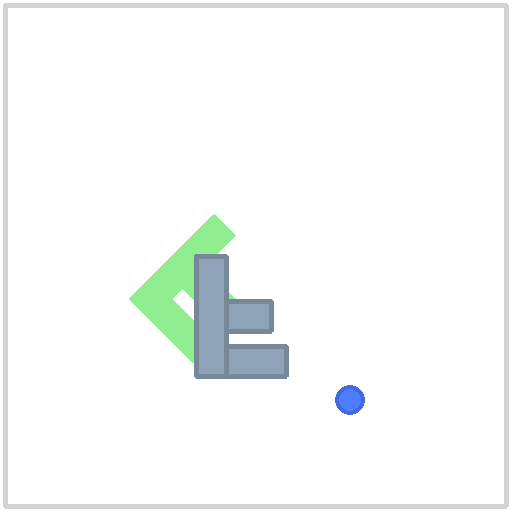
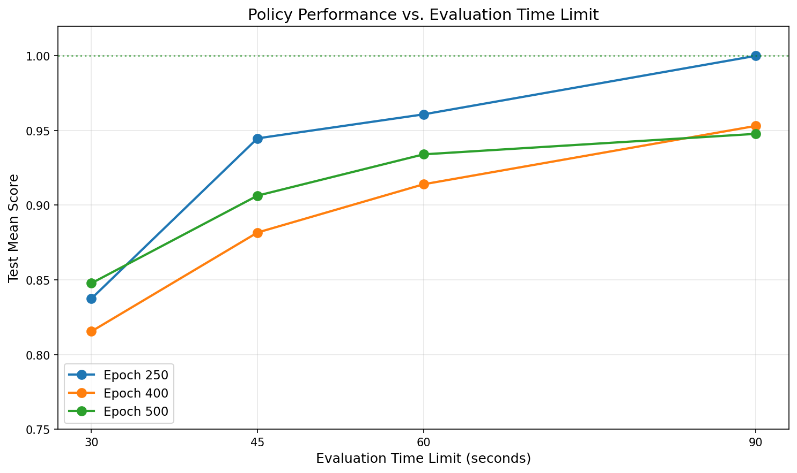
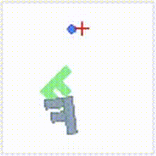
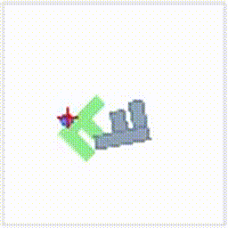
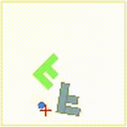
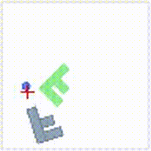

# Push-F: Training a Diffusion Policy to Push an F-Shaped Block

**Bryan Dong**

## Overview

This report describes my experience adapting the [Diffusion Policy](https://diffusion-policy.cs.columbia.edu/) codebase (Chi et al., 2023) to train a visuomotor policy for a new task: pushing an F-shaped block into a target orientation. The original codebase supports a T-shaped block ("Push-T"); my task was to modify it to support the "Push-F" variant, collect demonstration data, and train a policy.

## Approach

### Environment Modification

The Push-T environment defines the T-shaped block as two pymunk rectangles (a horizontal bar and a vertical stem). I created an analogous `add_f()` method using three non-overlapping rectangles: a vertical spine, a top horizontal bar, and a shorter middle horizontal bar. A `block_shape` parameter was threaded through the environment hierarchy (`PushTEnv` -> `PushTImageEnv` -> `PushTKeypointsEnv` -> runners -> configs) so that the same codebase supports both T and F blocks.

<p align="center">
  
  <br><em>The Push-F environment: gray F-block, green goal region, blue agent circle</em>
</p>

### Data Collection

I collected **101 human demonstrations** using the mouse-based teleoperation interface (`demo_pushf.py`) on my local MacBook, then uploaded the data to a GCP H100 machine for training. Each demonstration involved pushing the F-block from a random initial pose into the green target area.

### Training

I trained a **Diffusion Policy with CNN (UNet) architecture** using image observations (96x96 RGB + 2D agent position). Training used the default hyperparameters from the paper:
- Batch size: 64
- Learning rate: 1e-4 with cosine schedule
- Horizon: 16, n_obs_steps: 2, n_action_steps: 8
- ResNet18 image encoder with GroupNorm
- EMA enabled
- 500 epochs (~7 hours on H100)

The model checkpoint is available on Hugging Face (see [Reproducing Results](#reproducing-results) below).

## Results

### Training Curves

<p align="center">
  
</p>

The test mean score (evaluated every 50 epochs on 50 held-out environment seeds) rapidly improved to ~0.75 by epoch 50 and plateaued around 0.84-0.88 by epoch 200. The best checkpoint was at **epoch 250** with a test mean score of 0.880 under the default 30-second evaluation limit.

An interesting observation: validation loss began increasing after epoch 50, while task performance continued to improve. This demonstrates that for behavioral cloning with diffusion models, **the denoising loss is only a proxy** -- the actual task metric (geometric overlap coverage) can improve even as the surrogate loss overfits.

### Evaluation Time Limit Analysis

A key finding was that the default 30-second evaluation window was too short for many test seeds. Because this is pure behavioral cloning (supervised learning on demonstrations, no reinforcement learning), the policy imitates the speed of the demonstrations. My demonstrations averaged ~30.5 seconds, so the policy naturally takes about that long.

I evaluated the best checkpoint (epoch 250) across multiple time limits:

<p align="center">
  
</p>

| Time Limit | Mean Score | Perfect Seeds (1.0) | Seeds > 0.8 |
|:----------:|:----------:|:-------------------:|:-----------:|
| 30s        | 0.837      | 19/50               | 33/50       |
| 45s        | 0.945      | 38/50               | 44/50       |
| 60s        | 0.961      | 45/50               | 45/50       |
| **90s**    | **1.000**  | **50/50**           | **50/50**   |

With 90 seconds, the epoch 250 checkpoint achieves a **perfect score on all 50 test seeds**. This confirms that the policy has learned the correct behavior -- it simply needs sufficient time to execute it.

I also compared across checkpoints to test whether later (more overfit) checkpoints might perform better with more time:

| Checkpoint | 30s | 45s | 60s | 90s |
|:----------:|:---:|:---:|:---:|:---:|
| Epoch 250  | 0.837 | 0.945 | 0.961 | **1.000** |
| Epoch 400  | 0.815 | 0.882 | 0.914 | 0.953 |
| Epoch 500  | 0.848 | 0.906 | 0.934 | 0.948 |

Epoch 250 dominates across all time limits. Later checkpoints show mild overfitting that degrades generalization.

### Policy Videos

Below are example rollouts of the trained policy (epoch 250 checkpoint):

**30-second evaluation (default):**

<p align="center">


</p>

**60-second evaluation:**

<p align="center">


</p>

**90-second evaluation (perfect score):**

<p align="center">


</p>


## Challenges

### Human Demonstration Difficulty

The most surprising challenge was how difficult the Push-F task is *for a human*. While translating the F-block toward the target is straightforward, **rotating it into the correct orientation is genuinely hard**. The F-shape's asymmetry and the indirect nature of pushing (you can only push, not grab) make precise rotation control very tricky. Collecting fast, clean demonstrations required significant practice, and my average demonstration time of ~30.5 seconds reflects this difficulty.

### Evaluation Time Mismatch

Because Diffusion Policy is pure behavioral cloning -- the model learns to replicate the exact behavior in the demonstrations, including the pace -- the policy inherits the speed of the demonstrator. The default 30-second evaluation window was barely enough given my demonstration speed. This highlights an important property of imitation learning: **the policy is only as fast as the teacher**. Faster demonstrations would have yielded a faster policy.

### Dependency Version Conflicts

The codebase was originally built with Python 3.9, `gym==0.21.0`, `numpy==1.23.3`, and `pymunk==6.2.1`. Using newer versions caused various incompatibilities (gym API changes, numpy deprecations, pymunk API changes). The solution was to use the provided `conda_environment.yaml` with pinned versions and only upgrade PyTorch to support the H100 GPU.

## What I Enjoyed

I enjoyed the process of understanding how the different pieces of the codebase fit together -- the environment, dataset, policy, and evaluation runner -- and seeing how a few targeted modifications (adding the F-shape geometry and threading a parameter through) were enough to create an entirely new task. It was satisfying to watch the policy go from random behavior to successfully pushing the F-block within just 50 training epochs.

I also found the analysis of evaluation time limits interesting. It was a good exercise in understanding the implications of pure supervised learning: the model has no concept of time pressure or reward, so its behavior is entirely shaped by the demonstrations.

## What I Enjoyed Less

The dependency management was tedious. Getting the right combination of Python, PyTorch, gym, numpy, and pymunk versions to work together on a modern H100 GPU required some trial and error. This is a common pain point in research codebases that pin old versions.

## Reproducing Results

### Quick Start

```bash
# Clone the repo
git clone https://github.com/bryandong24/reu_adaptation.git
cd reu_adaptation

# Create conda environment (Linux with NVIDIA GPU)
mamba env create -f conda_environment.yaml
conda activate robodiff

# If on H100 or newer GPU, upgrade PyTorch:
pip install torch==2.0.1+cu118 torchvision==0.15.2+cu118 --extra-index-url https://download.pytorch.org/whl/cu118

# Install the package
pip install -e .
```

### Collecting Your Own Demonstrations (MacOS)

```bash
conda create -n pushf python=3.10 -y
conda activate pushf
pip install pygame "pymunk<7" "numpy<2" shapely scikit-image opencv-python click "zarr<3" gym
pip install -e .
python demo_pushf.py -o data/pushf/pushf_demo.zarr
```

### Training

```bash
conda activate robodiff
wandb login
python train.py --config-name=train_diffusion_unet_image_pushf_workspace
```

Training runs for 3000 epochs by default. Good performance is typically reached by epoch 250.

### Evaluating a Checkpoint

```bash
python eval.py --checkpoint data/outputs/<your_run>/checkpoints/epoch=0250-test_mean_score=0.880.ckpt -o data/eval_output
```

To evaluate with a custom time limit, use the evaluation sweep script:

```bash
python eval_sweep.py
```

### Model Checkpoint

The trained model checkpoint (~4.3 GB) is too large for GitHub. It is available at: **[huggingface.co/bryandong/pushf-diffusion-policy](https://huggingface.co/bryandong/pushf-diffusion-policy)**

The checkpoint includes the full model weights, EMA weights, optimizer state, and training configuration.

### Project Structure

```
reu_adaptation/
  diffusion_policy/
    env/pusht/pusht_env.py          # F-shape geometry (add_f method)
    env_runner/pusht_image_runner.py # block_shape parameter support
    config/task/pushf_image.yaml     # Push-F task config
    config/train_diffusion_unet_image_pushf_workspace.yaml  # Training config
  demo_pushf.py                      # Manual demo collection (mouse GUI)
  eval_sweep.py                      # Multi-checkpoint, multi-time evaluation
  report/                            # Report assets (plots, videos)
  data/pushf/pushf_demo.zarr/        # Demonstration dataset (101 episodes)
  data/pushf_eval_sweep/             # Evaluation results (JSON)
```
